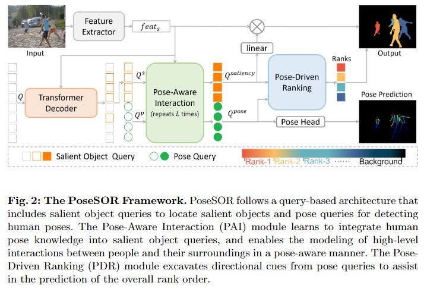
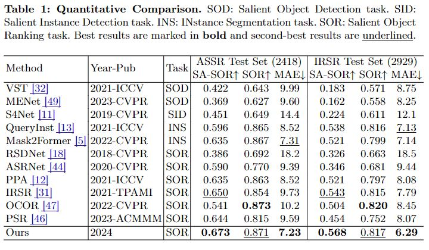
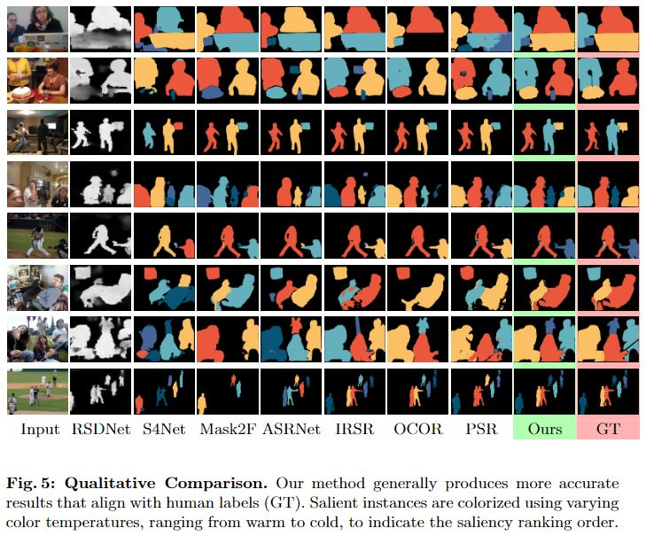
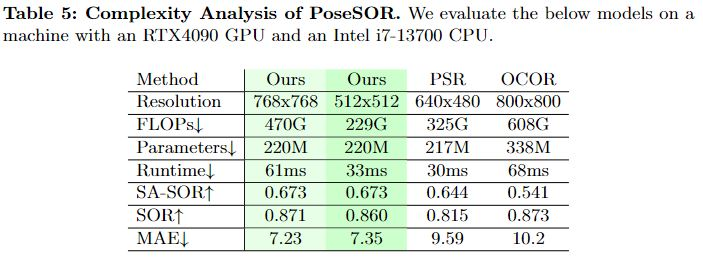

# (ECCV2024) PoseSOR: Human Pose Can Guide Our Attention
>  [Huankang Guan](https://scholar.google.com/citations?user=jI0LxMoAAAAJ&hl=en) and [Rynson W.H. Lau](https://www.cs.cityu.edu.hk/~rynson/)

> Department of Computer Science, City University of Hong Kong

[[dataset]](https://github.com/guanhuankang/ECCV24PoseSOR/tree/main/ECCV24_PoseSOR_dataset) [[poster]](#) [[suppl]](__doc__/02792-supp.pdf)

## Dataset
**Our dataset is avaiable [here](https://github.com/guanhuankang/ECCV24PoseSOR/tree/main/ECCV24_PoseSOR_dataset).**

## Abstract
Salient Object Ranking (SOR) aims to study how human observers shift their attention among various objects within a scene. Previous works attempt to excavate explicit visual saliency cues, e.g., spatial frequency and semantic context, to tackle this challenge. However, these visual saliency cues may fall short in handling real-world scenarios, which often involve various human activities and interactions. We observe that human observers' attention can be reflexively guided by the poses and gestures of the people in the scene, which indicate their activities. For example, observers tend to shift their attention to follow others' head orientation or running/walking direction to anticipate what will happen. Inspired by this observation, we propose to exploit human poses in understanding high-level interactions between human participants and their surroundings for robust salient object ranking. Specifically, we propose PoseSOR, a human pose-aware SOR model for the SOR task, with two novel modules: 1) a Pose-Aware Interaction (PAI) module to integrate human pose knowledge into salient object queries for learning high-level interactions, and 2) a Pose-Driven Ranking (PDR) module to apply pose knowledge as directional cues to help predict where human attention will shift to. To our knowledge, our approach is the first to explore human pose for salient object ranking. Extensive experiments demonstrate the effectiveness of our method, particularly in complex scenes, and our model sets the new state-of-the-art on the SOR benchmarks. Code and dataset are available at https://github.com/guanhuankang/ECCV24PoseSOR.

## Overview of PoseSOR


## Evaluation of PoseSOR




## Performance of PoseSOR


## Train & Inference
### Model Cards

Swin-L Transformer pretrained weight can be downloaded from [our google drive](https://drive.google.com/file/d/1zuxsowmxrR_1_MejfOxHD1D6_xAXhdir/view?usp=drive_link).

| Model                            | Dataset | Checkpoint                                                   | SA-SOR | SOR   | MAE  |
| -------------------------------- | ------- | ------------------------------------------------------------ | ------ | ----- | ---- |
| PoseSOR                          | ASSR    | [checkpoint](https://drive.google.com/file/d/1MvhyNeWOuaW_El1Re7d7k0mdhLQKljEh/view?usp=sharing) | 0.673  | 0.871 | 7.23 |
| PoseSOR                          | IRSR    | [checkpoint](https://drive.google.com/file/d/1bl1O7Gu2Ilmllm-xp62nx-LPwyfXiVIZ/view?usp=sharing) | 0.568  | 0.817 | 6.29 |
| PoseSOR-w/o-Pose-Knowledge (ID2) | ASSR    | [checkpoint](https://drive.google.com/file/d/1s8_xun_88sn8PfKS0S5Ko54BM0bYmC3G/view?usp=sharing) | 0.665  | 0.856 | 7.70 |

### Training & Inference
We provide our training & inference details in `assets/model_cards`, where you can also find our results in coco format. We provide the computation friendly configuration as follows:

For training (computation friendly configuration):
```shell
## download pretrained weights from model cards above. and put it into "assets/pretrained/swin_large_patch4_window12_384_22k.pth"
python train_net.py --config-file configs/swinL.yaml --num-gpus 1 \
    SOLVER.IMS_PER_GPU 16  \
    INPUT.TRAIN_IMAGE_SIZE 512 \ 
    INPUT.TEST_IMAGE_SIZE 512 \
    INPUT.DYNAMIC_SIZES "((480,480),(512,512),(544,544))" \
    SOLVER.STEPS "(20000,)" \
    SOLVER.MAX_ITER 30000 \
    DATASETS.TRAIN "('assr_train',)" \
    DATASETS.TEST "('assr_test',)" \
    DATASETS.ROOT REPLACED_WITH_YOUR_DATASET_ROOT \
    MODEL.WEIGHTS "assets/pretrained/swin_large_patch4_window12_384_22k.pth" \
    OUTPUT_DIR output/assr_id1_train
```

For inference:
```shell
python train_net.py --config-file configs/swinL.yaml --eval-only \
    INPUT.TEST_IMAGE_SIZE 512 \
    DATASETS.TEST "('assr_test',)" \
    OUTPUT_DIR output/assr_id1_test 
    MODEL.WEIGHTS {{CKP_PATH}}
```

where `CKP_PATH` refers to the checkpoint file.

## Cite
```html
@InProceedings{Guan_ECCV24_PoseSOR,
    author="Guan, Huankang
    and Lau, Rynson W. H.",
    title="PoseSOR: Human Pose Can Guide Our Attention",
    booktitle="ECCV",
    year="2024",
    publisher="Springer Nature Switzerland",
    pages="350--366",
    isbn="978-3-031-72649-1",
    url="https://link.springer.com/chapter/10.1007/978-3-031-72649-1_20"
}
```

Feel free to discuss/post your questions in the issue pannel!

Contact: Huankang.Guan@my.cityu.edu.hk
